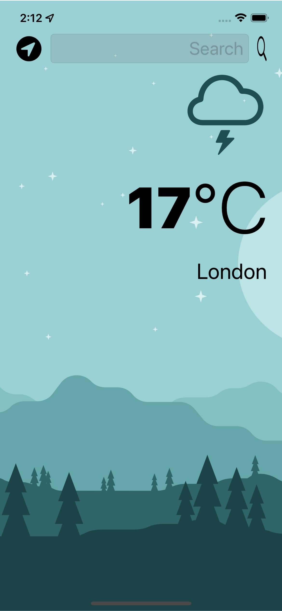
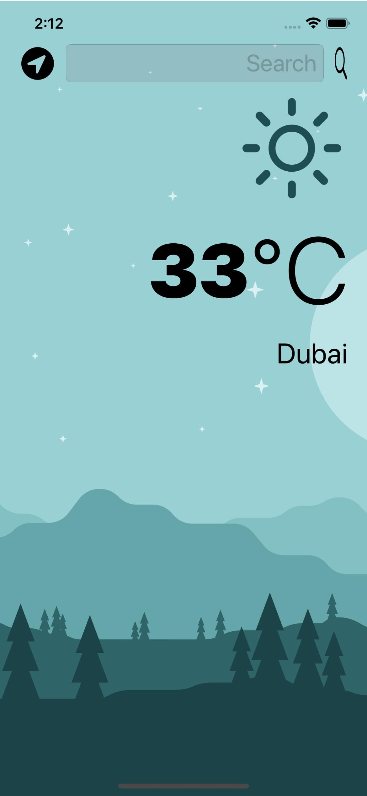

# WeatherApp

   
  

# Description

This is a just a regular WeatherApp tha allows the user to either Get the weather at his location or Search Cities around the world

# Tools Used
### -  Swift
### - CoreLocation(Get the user's location)
### - OpenWeatherAPI 
